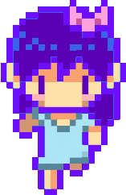

# — AmySparkNG's web ✨

Website i started making to learn about `html, css, js` and stuff, hope you like it!

You may remember this website being different, i kind of just changed it be simpler! So yeah that's it

## Credits:

- _Some backgrounds, pfp, favicon and the gif below:_ **OMOCAT** ([TW](https://twitter.com/_omocat))

- _CSS Help:_ - **LajBel** ([TW](https://twitter.com/lajbel_land))

- _Most of the SVGS used:_ **Fontawesome** ([page](https://fontawesome.com/))

- _Rest of the page:_ - **me, [AmySpark](https://amySpark-ng.github.io)**

 

 

amyspark-ng

